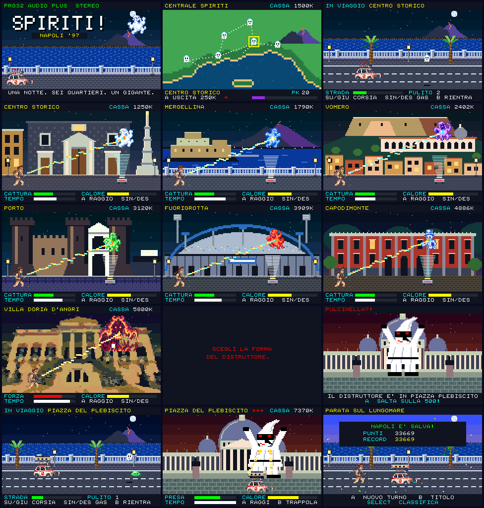

# Spiriti! Napoli '97 — PRG32 cartridge

An unofficial **Ghostbusters-inspired tribute game** for [PRG32](https://github.com/riscv-prg32/PRG32) `main`, set in Naples in 1997. Code, pixel art and music are original: the game evokes the 1984 paranormal-comedy arcade tradition without shipping the protected logo, soundtrack, dialogue or sprites.



[A playthrough recorded from the QEMU firmware, with its soundtrack](preview.mp4): the first call-out, then everything from Villa Doria d'Angri to the parade.

## The night shift

1. **Dispatch map.** Six haunted districts around the Gulf of Naples. `LEFT`/`RIGHT` choose, `A` sends the Fiat 500 out for 250K lire.
2. **Lungomare.** Three lanes along the bay; `UP`/`DOWN` change lane, `RIGHT`/`LEFT` accelerate and brake. Slime on the road is there to be cleaned: drive over it. Spirits fly in over a lane (their shadow shows which) and slime whatever is under them when they reach the car: be somewhere else. A puddle left behind, or a slimed car, feeds the city's psychokinetic (PK) energy; espresso buys time at the capture.
3. **Capture**, in front of a Naples landmark: the Gesù Nuovo and its spire, Castel dell'Ovo with the Vesuvius across the bay, Castel Sant'Elmo over the Certosa di San Martino, the Maschio Angioino, the stadium at Fuorigrotta, the Reggia di Capodimonte. Hold `A` to keep the spirit in the proton beam and move the trap under it with `LEFT`/`RIGHT`. The pack heats up while it fires: at the top it vents, and the beam is off until it cools.
4. **Villa Doria d'Angri.** With the six districts clear, a guardian appears on the terrace of the villa at Posillipo. No trap will hold it: wear it down with the pack, and move the hunter out from under the fire it throws.
5. **"Scegli la forma del distruttore."** The guardian's last words. The form is a giant, evil Pulcinella, rising over Piazza del Plebiscito.
6. **The run to the piazza**, with a giant trap bolted to the Fiat's roof.
7. **Piazza del Plebiscito.** `A` fires two rays from the car to bind the giant. When he is bound, `B` opens the trap, and the car must be under him. Three times, and he is drawn into it. Open the trap too early and the hold slips.
8. **The parade** on the lungomare, at dawn.

PK energy climbs all night and falls with every capture; it stains the sky green as it rises. The shift ends with the parade, when the till cannot pay for another call-out, or when PK energy reaches 100. `SELECT` on the title shows the high scores.

## What it uses from PRG32

- **Indexed colours.** Everything is drawn with `prg32_sprite_draw_indexed` and `prg32_gfx_rect_indexed`. The ESP32-C6 framebuffer holds one byte per pixel and maps each RGB565 colour to a cell of a 6x6x6 cube; the cartridge programs each of its colours into its cell with `prg32_palette_set`, so the board shows the authored colours, the same as QEMU.
- **Pictures as indexed rectangles.** The landmarks, the giant, the map and the logo are stored as bands of runs and drawn enlarged, one rectangle per run: eight landmarks take 9 KiB. Villa Doria d'Angri is converted from a photograph; the others are drawn by the generator. See [docs/ASSET_PIPELINE.md](docs/ASSET_PIPELINE.md).
- **Palette effects.** Fades, the capture flash, spirits that glow along their own colour ramp, the cycling beam, stars, trap light, lightning, the PK-stained sky, the giant flashing when bound, the dawn.
- **SID-like stereo audio.** Ten procedural instruments and ten original tracker tracks in a PCM-free AUDIO block, one for each kind of scene. The game changes the tracker's tempo as it plays: with the speed of the car, when a spirit's patience runs low, round by round against the giant. Music plays on voices 0-3; beam, siren, engine and other effects use voices 4-7 and are panned by screen position.
- **Portable ABI build**, scoreboard, bounded random numbers.

[INTEGRATION.md](INTEGRATION.md) lists the calls and the firmware behaviour the cartridge relies on.

## Build

Needs a checkout of `riscv-prg32/PRG32` `main`, the ESP-IDF RISC-V toolchain, and Python with Pillow and NumPy.

```sh
export PRG32_REPO=/path/to/PRG32
./build.sh
```

`build.sh` regenerates the art and the score, runs the tests, builds the portable cartridge, attaches the Store metadata for `esp32c6` and `qemu`, packs the bundle and, when a `CartridgeStore` checkout is next to this one (or `CARTRIDGE_STORE_ROOT` is set), validates it with the Store's own intake code.

```text
dist/store/spiriti-napoli97-esp32c6.prg32
dist/store/spiriti-napoli97-qemu.prg32
dist/spiriti-napoli97-3.0.0-store.zip
```

The cartridge runs on the default 64 KiB cartridge-RAM profile of the ESP32-C6 and QEMU firmware, not on the 32 KiB classroom profile.

## Test

```sh
./test.sh
```

- `tests/source_checks.py`: static checks, including that colours shown together never share a palette cell and that every picture decodes to its size.
- `tests/host_syntax.sh`: strict C99.
- `tests/run_harness.sh`: a bot plays the whole night, from the first call to the parade, on a software model of both display back ends and fails on any pixel that differs between QEMU and the ESP32-C6; then it exercises the rules and the failure paths.

`make screens` renders the harness frames in `release-artifacts/screens/`. `make capture` plays the cartridge in the QEMU firmware, by looking at the picture, and records `preview.mp4` and the Store screenshot. [VALIDATION.md](VALIDATION.md) says what has been verified and what has not.

## Tribute / rights notice

**Spiriti! Napoli '97 is a tribute game.** It is unofficial, non-commercial in intent, and not affiliated with, endorsed by, or sponsored by the Ghostbusters rights holders. Ghostbusters is mentioned only to identify the cultural work being paid tribute to. The project contains original title treatment, pixel artwork, music, sound design and code. Pulcinella is a traditional mask of the commedia dell'arte. Trademarks and third-party rights remain with their respective owners.
