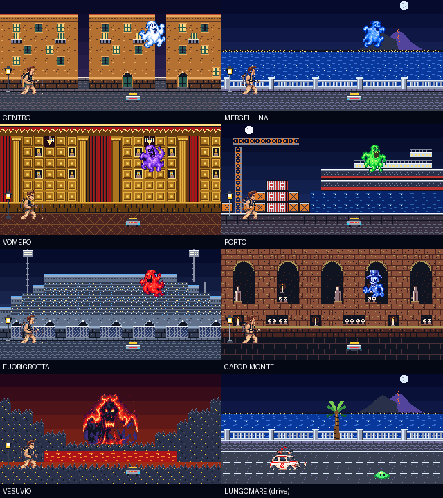

# Asset pipeline

`tools/generate_assets.py` writes `assets.h`; `tools/generate_audio.py` composes the score and writes `audio.json`. Both are deterministic.

## Sources

- The Fiat, the hunter, six spirits and the Vesuvius apparition are converted from the pixel-art crops in `assets-src/` to 4-bpp sprites (15 colours and a transparent index). The spirits' palettes are sorted from dark to bright, which is what lets them glow (below).
- The districts, props, logo, far Vesuvius and dispatch map are drawn by the generator, pixel by pixel. The scenery crops in `assets-src/` (`centro.png`, `map.png`...) are art-direction references only.

## Tiles as roles

The 49 tiles are 16x16 at 4 bpp. A pixel value is a *role*, not a colour: outline, three wall tones, two accents, dark and lit window, glow, two ground tones, deep and light (water, foliage, lava), metal, highlight. Each of the seven districts has a 16-colour palette that gives the roles its own materials, so one tile bank serves them all: the water tile is the bay at Mergellina and the lava lake on the Vesuvius. Role 0 is transparent, for rooflines and cranes drawn over the sky.

A district is a 20x10 map written as text in the generator. The drive has its own map, with the bay, the balustrade and the road scrolling at different speeds.

## One colour per cube cell

The ESP32-C6 firmware maps each sprite colour to the cell of its 6x6x6 colour cube (`16 + r*36 + g*6 + b`, each channel scaled to 0..5) and stores that index in the framebuffer. Two colours in the same cell would be shown as one. The generator therefore places every colour that can be on screen together in a cell of its own:

- the shared colours (interface navy, props, hunter, Fiat) are placed first;
- each spirit is placed against the shared colours;
- each district is placed against the shared colours and the spirits that appear in it;
- a colour that lands in a used cell takes the colour already there when that is the smaller error, otherwise it moves to the nearest free cell. The generator prints a note when a colour moves far;
- the eight firmware named colours are exact everywhere and need no cell.

At run time `program()` in `game.c` writes each colour to its cell with `prg32_palette_set`. `tests/source_checks.py` and the host harness both fail if two colours shown together share a cell.

## Effects and the palette

- **Spirits** glow by shifting along their own dark-to-bright ramp, and flash white in the trap. Every colour they show is one of their authored colours or a named colour, so no cell changes.
- **Sky, beam, stars, trap cone, sea, map, meters** use palette entries 8-15 and 232-255, which the cube never maps to. They are drawn with `prg32_gfx_rect_indexed` and recoloured freely every frame.
- **Fades and flashes** blend every colour. Colours that meet in a cell merge on the board for those few frames, which is what a fade looks like anyway.

## Dispatch map

The Gulf of Naples is three nested masks (beach, land, hills) stored as horizontal runs of 4x4 cells, 720 bytes, and drawn as indexed rectangles.

## Sizes

| Asset | Format | Bytes |
| --- | --- | ---: |
| 49 tiles | 4 bpp | 6272 |
| Vesuvius apparition 96x72 | 4 bpp | 3456 |
| Six spirits 40x40 | 4 bpp | 4800 |
| Fiat 72x36, hunter 32x48 | 4 bpp | 2064 |
| Props: trap, slime, lamp, palm, cup, markers | 4 bpp | 1880 |
| Far Vesuvius 96x32 | 2 bpp | 768 |
| Logo 192x28 | 1 bpp | 672 |
| Dispatch map runs | bytes | 720 |
| District and road maps | bytes | 1600 |
| Palettes | RGB565 | about 800 |

Development dependencies are Pillow and NumPy; the cartridge depends on neither.
